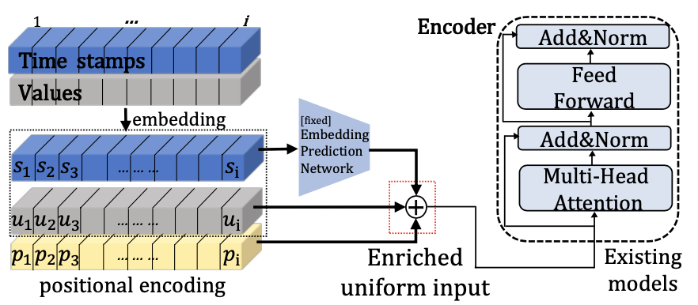

#  Look Ahead


This repository contains the code of [Look Ahead] Improving the Accuracy of Time-Series Forecasting by Previewing Future Time Features 
<p align="center">

<br><br>
</p>

# Dependencies

* Python 3.6
* matplotlib == 3.1.1
* numpy == 1.19.4
* pandas == 0.25.1
* scikit_learn == 0.21.3
* torch == 1.8.0

# Datasets
* https://github.com/zhouhaoyi/ETDataset
* https://archive.ics.uci.edu/ml/datasets/Appliances+energy+prediction
* https://archive.ics.uci.edu/ml/datasets/Power+consumption+of+Tetouan+city

# Training and Evaluation
In order to train a model for LookAheaed, use test_ax_learning.py script. Following are the main parameters for training:
```
--len : time stamp embedding input length 
--time_point : time stamp after 𝛼 steps


python test_ax_learning.py
python test.py
```


## Acknowledgement

We appreciate the following github repos a lot for their valuable code base or datasets:

https://github.com/thuml/Autoformer

https://github.com/zhouhaoyi/Informer2020

https://github.com/zhouhaoyi/ETDataset

